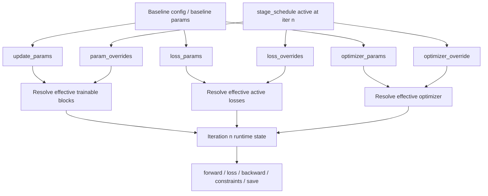
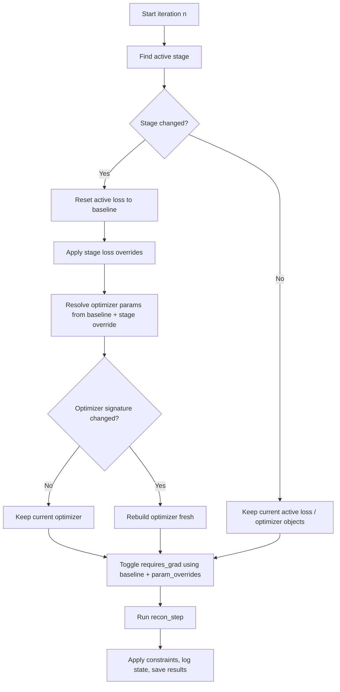

# PtyRAD Stage Schedule Patch README


## 0. What this README is for

1. **我改了什么功能**
2. **为什么这样改**
3. **怎么写配置文件并使用**

---

## 1. 我们做了什么功能

我们在原始 PtyRAD 的基础上，引入了一个统一的 `stage_schedule` 控制层.
The key idea is to support **stage-wise optimisation control inside a single reconstruction run**.

通过这个机制，同一条 reconstruction trajectory 可以在不同 iteration 区间里，改变以下三类内容:

1. **trainable parameter blocks**  
   哪些参数块在当前阶段参与训练、哪些被冻结.

2. **active loss terms and their weights**  
   哪些 loss 项在当前阶段开启/关闭，以及它们的权重如何变化.

3. **optimizer family / optimizer configs**  
   当前阶段使用什么优化器，例如 `Adam -> LBFGS`，以及对应的 optimizer configs.

这三个能力分别对应我们开发过程中的三个 phase:

- **Phase 1**: parameter scheduling  
- **Phase 2**: loss scheduling  
- **Phase 3**: optimizer stage switch

后续有.diff文件会细致标注每一部分的改动.
---

## 2. 我们的实现逻辑, 以及为什么这样做

### 2.1 总体原则: baseline-first, override-based

这次 patch 的设计原则是：

- `model_params.update_params` 仍然定义 **baseline trainability**;
- `loss_params` 仍然定义 **baseline objective**;
- `model_params.optimizer_params` 仍然定义 **baseline optimizer**;
- `recon_params.stage_schedule` 只对这些 baseline 做 **局部阶段覆盖（local overrides）**.

也就是说baseline 先定义默认世界，stage 只写“哪里和默认世界不一样”.

---

### 2.2 运行时是怎么工作的

在原始 PtyRAD 的 reconstruction loop 中，每个 iteration 大体是：

- 根据 baseline `update_params` 决定当前谁可以训练；
- 执行 forward / loss / backward / optimizer step；
- 应用 constraints；
- 保存结果与日志。

我们的 patch 做的事情是：在每个 iteration 开始时，先多做一步 **stage resolution**：

1. 判断当前 iteration 属于哪个 stage；
2. 如果 stage 改变了：
   - 重新解析 active parameter blocks；
   - 重新解析 active loss dictionary；
   - 如有需要，重建 optimizer；
3. 然后继续进入原来的 reconstruction logic。

所以增加的这个控制层并不会影响运行速度(实测可忽略不计),因为:

> stage layer 是套在原始 reconstruction loop 外面的一个轻量控制层

---

### 2.3 整体流程图

为了便于理解, 简单的整体workflow如下图所示:


---

### 2.5 Stage transition flow

对应的Stage_Schedule的判断逻辑大致如下图, 具体可以参考代码:



---

## 3. What was changed in code

### 3.1 改动的核心模块

这次 patch 主要修改了 5 个模块：

- `recon_params.py`
- `losses.py`
- `reconstruction.py`
- `hypertune.py`
- `save.py`
---

## 3.2 Module-by-module summary

#### A. `recon_params.py`

**作用**  
负责定义和校验新的 `stage_schedule` schema.

**新增内容**

- `StageParamOverride`
- `StageLossOverride`
- `StageOptimizerOverride`
- `StageScheduleEntry`
- `ReconParams.stage_schedule`
- 对 stage 合法性的校验逻辑

**它解决的问题**

- 让 YAML 写法有明确结构;
- 提前在参数层面发现配置错误，而不是运行半天才报错;
- 统一 parameter / loss / optimizer 三个 override 维度的语义.

**注意事项**

- stage 必须有序;
- stage 不允许 overlap;
- `start_iter` inclusive，`end_iter` exclusive;
- `end_iter: null` 只允许出现在最后一个 stage;
- stage 允许有 gap，gap 内部会自动 fallback 到 baseline.

---

#### B. `losses.py`

**作用**  
让 loss configuration 具备“baseline + active-stage”双层状态.

**新增逻辑**

- 保存 `base_loss_params`
- 支持 `reset_to_base_loss_params()`
- 支持 `apply_stage_loss_overrides(...)`
- 生成 `active_loss_summary`

**它解决的问题**

原始 loss object 只有一套 active loss dictionary.
现在我们需要在 stage boundary 时:

- 先恢复 baseline objective;
- 再应用当前 stage 的局部 loss override.

这样可以避免 stage-to-stage 累积污染.

**注意事项 / Notes**

- stage loss 不是累积的;
- 如果某个 stage 没写 `loss_pacbed: {state:false}`，那它不会被关闭;
- omission = inherit baseline，不是 turn off.

---

#### C. `reconstruction.py`

**作用**  
这是 staged runtime control 的核心模块.

**新增逻辑**

- stage detection
- stage boundary handling
- `toggle_grad_requires(..., stage_entry=...)`
- loss reset + stage loss application
- optimizer resolution / optimizer rebuild
- active-state logging
- `stage_event_log`
- `optimizer_rebuild_log`

**它解决的问题**

简单来说, 把 `stage_schedule` 从配置文件中读取后, 来真正实现.

**特别重要的几点**

1. `param_overrides` 只改变 `requires_grad`.  
   它不会自动重建 optimizer parameter groups.

2. stage 切换时，optimizer 只有在 **signature changed** 时才会 rebuild. 
   Signature 主要看：
   - optimizer `name`
   - optimizer `configs`

3. 如果跨 optimizer family 切换，例如 `Adam -> LBFGS`，默认是 **fresh rebuild**。  
   也就是说，不继承 Adam 的历史状态.

4. 当前实现里，如果只是 `load_state` 变了，但 optimizer signature 没变，**不一定会触发 rebuild**. 
   所以不能想当然地认为 stage-local `load_state` 一定会被应用.

5. 当 active objective 发生变化时，**不同 stage 的 total loss 不能直接硬比**.
   这一点代码日志里也会主动提醒.

---

#### D. `hypertune.py`

**作用**  
让 Optuna / hypertune path 也理解 `stage_schedule`.

**为什么要改**

如果 reconstruction mode 支持 staged schedules，但 hypertune mode 还是旧逻辑，那你会得到两套不一致的 runtime semantics。  
所以这里也同步接入了 stage-aware logic.

**注意事项 / Notes**

- reconstruction mode 和 hypertune mode 在 stage semantics 上尽量保持一致；
- 但 hypertune 仍然保留它自己的 trial-level batch handling 行为；
- 所以如果你要做最干净的 staged controlled study，reconstruction mode 通常更合适。

---

#### E. `save.py`

**作用 / Role**  
把 staged provenance 一起存入输出文件.

**新增内容 / Key additions**

- `stage_event_log`
- `optimizer_rebuild_log`
- `base_loss_params`
- `active_loss_params`
- `active_loss_summary`
- `base_optimizer_params`
- `active_optimizer_params`
- `active_optimizer_summary`

**为什么重要**

以前只看 checkpoint，很难回答：

- 当时到底开着哪些 loss？
- 当前 optimizer 是谁？
- 是不是刚刚 rebuild 过？
- 当前 stage 到底是什么？

现在这些信息基本都能追溯了。

**注意事项 / Notes**

- `stage_event_log` 主要记录 stage、param/loss active state;
- 更完整的 optimizer provenance 在 `optimizer_rebuild_log` 和 optimizer snapshot 相关字段里;
- 所以不要误以为 `stage_event_log` 本身包含所有 optimizer 细节.

---

### 3.4 Important caveats

#### (1) omission ≠ off

如果你想关闭某个 loss，必须显式写:

```yaml
loss_pacbed: {state: false}
```

省略它只是继承 baseline.

---

#### (2) `train: true` 不能复活 zero-lr block

如果 baseline 里某个参数块是:

```yaml
start_iter: null
lr: 0
```

那么 stage 里写 `train: true`，也不会让它真正参与优化.

---

#### (3) stage 间 total loss 不总是可比

如果 stage 改了 active objective，例如:

- stage A: `single + sparse`
- stage B: `single + pacbed + sparse`

那么 total loss 曲线出现 jump 是正常的.
这并不代表优化一定退步了，而可能只是“记分公式变了”.

---

#### (4) optimizer rebuild = fresh state（大多数情况）

只要 optimizer family 或 configs 变了，通常就会 rebuild.
这意味着:

- Adam moments 不会自动继承到新的 optimizer;
- 即使同 family 改 configs，也可能 fresh rebuild;
- 所以 stage-based optimizer studies 要特别小心解释.

---

#### (5) LBFGS 是特殊项 / LBFGS is special

当前实现里，LBFGS 需要特殊理解:

- 它没有 per-parameter LR 语义;
- 只能用一个 global LR;
- memory cost 更高;
- 运行时依赖 closure;
- mini-batch 场景下的意义也和 first-order optimizer 不完全一样.

所以：

> optimizer stage switch 可以做，但解释要谨慎.

---

#### (6) constraints 目前不在 stage_schedule 里

当前 `stage_schedule` 控制的是: 

- parameter trainability
- active losses
- optimizer

**并不控制 constraints**。  
所以某些 parameter 虽然在当前 stage 不训练，但仍然可能继续受 persistent constraints 的影响.

这在解释结果时一定要注意.

---

## 4. 如何使用

### 4.1 基本入口

新的控制入口是在 `recon_params` 里面加入:

```yml
recon_params: {
    'stage_schedule': [
        {
            'name': 'example_stage',
            'start_iter': 1,
            'end_iter': 21,
            'param_overrides': {
                'probe': {'train': false}
            },
            'loss_overrides': {
                'loss_pacbed': {'state': false},
                'loss_sparse': {'state': true, 'weight': 0.1, 'ln_order': 1}
            },
            'optimizer_override': {
                'name': 'LBFGS',
                'configs': {
                    'lr': 2.0e-4,
                    'max_iter': 5,
                    'history_size': 10,
                    'shuffle_batches': false
                }
            }
        }
    ],
}
```

字段解释:

- `'name'`: stage 名字，主要用于 log 和 provenance
- `'start_iter'`: **inclusive**，这个 iteration 开始进入该 stage
- `'end_iter'`: **exclusive**，到这个 iteration 前一轮结束
- `'param_overrides'`: 只覆盖列出的 parameter blocks
- `'loss_overrides'`: 只覆盖列出的 loss entries
- `'optimizer_override'`: 当前阶段的 optimizer 覆盖

---

### 4.2 三种最常用的写法

#### A. Parameter scheduling

下面这个例子表示: 前 30 次只让 object 更新，probe 和 geometry 先冻结；第 31 次以后回到 baseline.

```yml
'stage_schedule': [
        {
            'name': 'object_only_warmup',
            'start_iter': 1,
            'end_iter': 31,
            'param_overrides': {
                'probe': {'train': false},
                'probe_pos_shifts': {'train': false},
                'obj_tilts': {'train': false}
            }
        },
        {
            'name': 'back_to_baseline',
            'start_iter': 31,
            'end_iter': null
        }
]
```

**效果 / Behavior**

- iter `1–30`: 只让 `obja` / `objp` 主导训练
- iter `31+`: 回到 baseline `update_params` 所定义的默认 trainability
---

#### B. Loss scheduling

下面这个例子就是我们实际常用的动态 loss 设计：

```yml
'stage_schedule': [
        {
            'name': 'single_sparse_low',
            'start_iter': 1,
            'end_iter': 101,
            'loss_overrides': {
                'loss_pacbed': {'state': false},
                'loss_sparse': {'state': true, 'weight': 0.1, 'ln_order': 1}
            }
        },
        {
            'name': 'single_sparse_high',
            'start_iter': 101,
            'end_iter': 151,
            'loss_overrides': {
                'loss_pacbed': {'state': false},
                'loss_sparse': {'state': true, 'weight': 0.3, 'ln_order': 1}
            }
        },
        {
            'name': 'final_shared_objective',
            'start_iter': 151,
            'end_iter': null,
            'loss_overrides': {
                'loss_pacbed': {'state': true, 'weight': 0.3, 'dp_pow': 0.2},
                'loss_sparse': {'state': true, 'weight': 0.1, 'ln_order': 1}
            }
        }
]
```

**效果 / Behavior**

- early stage: 不用 PACBED，先做 `single + sparse(0.1)`
- mid stage: 提高 sparse 权重，强化 structure shaping
- late stage: 把 PACBED 作为较温和的 global term 加回来

---

#### C. late-stage optimizer switch

下面这个例子表示: 前 180 次用 baseline optimizer，最后 20 次切成 LBFGS.

```yml
'stage_schedule': [
        {
            'name': 'late_lbfgs_refine',
            'start_iter': 181,
            'end_iter': null,
            'optimizer_override': {
                'name': 'LBFGS',
                'configs': {
                    'lr': 2.0e-4,
                    'max_iter': 5,
                    'history_size': 10,
                    'shuffle_batches': false
                }
            }
        }
]
```

**效果 / Behavior**

- iter `1–180`: 用 baseline `model_params['optimizer_params']`
- iter `181+`: rebuild 成 LBFGS，并使用 fresh optimizer state

---

### 4.3 Taking Everthing Togather

下面这个例子能体现我们这次 patch 的完整能力:

```yml
'stage_schedule': [
        {
            'name': 'baseline_objective',
            'start_iter': 1,
            'end_iter': 101,
            'loss_overrides': {
                'loss_pacbed': {'state': false},
                'loss_sparse': {'state': true, 'weight': 0.1, 'ln_order': 1}
            }
        },
        {
            'name': 'obj_only_sparse_pulse',
            'start_iter': 101,
            'end_iter': 131,
            'param_overrides': {
                'probe': {'train': false},
                'probe_pos_shifts': {'train': false},
                'obj_tilts': {'train': false}
            },
            'loss_overrides': {
                'loss_pacbed': {'state': false},
                'loss_sparse': {'state': true, 'weight': 0.3, 'ln_order': 1}
            }
        },
        {
            'name': 'final_refine',
            'start_iter': 131,
            'end_iter': 181,
            'loss_overrides': {
                'loss_pacbed': {'state': true, 'weight': 0.3, 'dp_pow': 0.2},
                'loss_sparse': {'state': true, 'weight': 0.1, 'ln_order': 1}
            }
        },
        {
            'name': 'lbfgs_tail',
            'start_iter': 181,
            'end_iter': null,
            'optimizer_override': {
                'name': 'LBFGS',
                'configs': {
                    'lr': 2.0e-4,
                    'max_iter': 5,
                    'history_size': 10,
                    'shuffle_batches': false
                }
            }
        }
]
```

这个 combined example 可以同时表达:

- loss design
- object-only pulse
- late optimizer switching

---

### 4.4 Recommended workflow for writing configs

#### Step 1 — 先写完整 baseline

先把这些写完整：

- `model_params.update_params`
- `loss_params`
- `model_params.optimizer_params`

不要一开始就把所有东西丢进 `stage_schedule`.

#### Step 2 — 再把“真正变化的部分”写进 `stage_schedule`

原则是：

> baseline 写默认世界，stage 只写变化.

#### Step 3 — 跑完一定看 log

真正要看的不是“我写了什么”，而是 log 里打印的:

- `effective trainable blocks`
- `effective losses`
- `effective optimizer`

只有这些对了，才说明 stage 真的按你想的方式生效了.

---